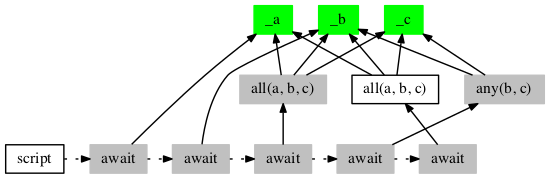
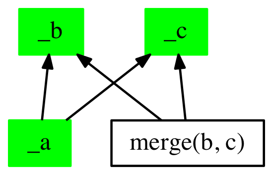
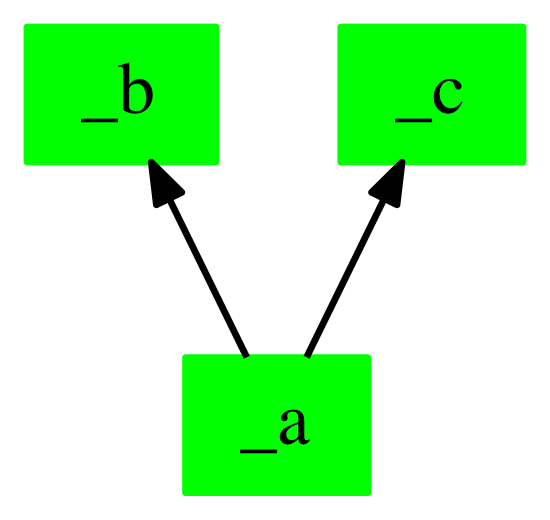
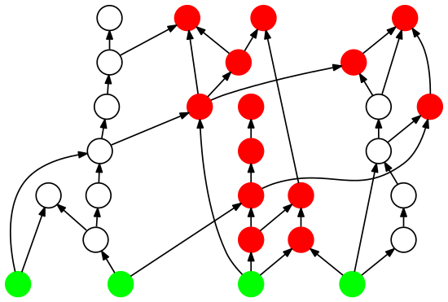
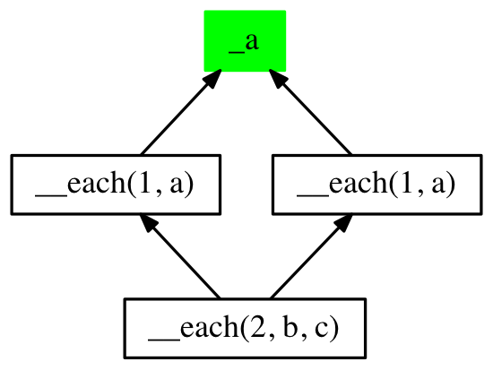

# Reactive C [](https://circleci.com/gh/christophevg/reactive-c)

An experiment on implementing a reactive programming (RP) API in pure C.  
Christophe VG (<contact@christophe.vg>)  
[https://github.com/christophevg/reactive-c](https://github.com/christophevg/reactive-c)

## Introduction

The origin of this experiment is the paper titled "[Deprecating the Observer Pattern with Scala.React](http://infoscience.epfl.ch/record/176887/files/DeprecatingObservers2012.pdf)". The goal of this experiment is to implement a RP API in C, thus making it available to e.g. embedded development in C.

### What do I consider RP?

The core of RP is an extended implementation of the observer pattern, or as I like to call it "_The Observer Pattern on Steroids_". There is no black magic in reactive programming, just a nice(r) API to construct and compose observers and observables. (IHMO)

### Why embedded?

Although RP typically focuses on UI development and proposes a solution to its (so called) callback hell, it is not difficult to see a strong link to embedded development. In stead of user interaction, the events that require observation now are changes in (digital and analogue) signals on IO ports,...

Being able to deal with these changes in a more natural way, might also prove to be beneficial to embedded development... if the incurred cost is acceptable.

### The Million $ Question

The questions this experiment wants to answer are "_Can the concepts of RP be applied to pure C programming? And is it worth the hassle?_ "

### Approach

Using different examples, some of the RP concepts are implemented in pure C. Given the nature of C, some compromises have to be made and certain aspects of RP require creative solutions. At the end, a more elaborate example will be implemented and evaluated against an implementation using "basic" observers.

### Disclaimer

1. This is an _experiment_, so the code is not to be considered stable ... until I state otherwise :-)
2. I probably violate many C best practices with respect to naming conventions, C idoms,... At this point the goal justifies the means and I'm trying to create some sort of internal DSL, using every macro-expansion trick I can find to achieve this.
3. The internet/Google is often my teacher, so if you think I used something you should be credited for, let me know, I have no intention to steal from you or disrespect your work in any way. I try to add references to my sources as much as I can.

## Getting Started

Rule of thumb for now: Take a look at the examples, which are also discussed below. 

Everything starts with ...

```c
#include "reactive-c/api.h"
```

## Examples

Each of the following examples introduces an aspect of RP and its implementation in the context of Reactive C.

### Observed Values (temperature.c)

The first concept is that of **observed values**. Given a value (read: variable) representing e.g. a temperature, we can turn it in an observable using the `observe` constructor. As there is no black magic, updates to the underlying variable need to be triggered using `observe_update`.

The following example demonstrates how to implement an observable temperature value. This can be implemented in a module of its own, hiding the internal temperature representation, only exposing the `observable_temp` observable.

```c
double temp = 123;

observable_t observable_temp;

void temp_init() {
  observable_temp = observe(temp);
}

void temp_update(double update) {
  temp = update;
  observe_update(observable_temp);
}
```

Given this basic observable, we can now observe it using an observer (function). We again use the `observe` constructor. This time we don't provide a (reference to) a variable, but provide it a list of observables, an observer function and the type of the output of that observer (function).

**Compromise #1**: C is statically typed. This means that an observer function also needs to be statically typed. To allow any kind of arguments and result, we need to resort to `void*` (which we also define as `unknown_t`) and **explicit casts** whenever we want to access these values.

An observer (function) has to adhere to the `observer_t` type, which is defined as `typedef void (*observer_t)(observation_t);`. Such an `observation_t` consists of components:

1. an array of `unknown_t` arguments, used by the observer (function) as input. 
2. a pointer to a single `unknown_t` result variable to hold the output of the observer (function).

**Compromise #2**: The output value also needs to be stored in memory somehow. Again, because C is statically typed and it provides no ways to access the type of a function through reflection, we also need to explicitly provide it to the `observe` constructor.

```c
void c2f(observation_t ob) {
  (*(double*)(ob->observer)) = ( (*(double*)(ob->observeds[0])) * 1.8 ) + 32;
}

int main(void) {
  observable_temp_init();

  observable_t temp_f = observe(just(observable_temp), c2f, double);
  ...
}
```
Note that observing some observable value, using an observer (function) also implies the creation of a new observable. Whenever the observed value changes, the observer (function) will be executed, resulting in an updated value. This way it becomes an observable. So we now can also observe `temp_f`, which is the temperature converted to Fahrenheit.

```c
void display(observable_t ob) {
  printf( "observable was updated to %fC/%fF\n",
          *(double*)(ob->observed[0]), *(double*)(ob->observed[1]) );
}
observable_t displayer = observe(both(observable_temp, temp_f), display);
```

Again we apply the `observe` constructor, now to observe both the `observable_temp` and `temp_f` observables. Notice the use of the helper constructors `just` and `both` to turn arbitrary lists of arguments in an array (technically a linked list) and pass it as the first argument to the `observe` constructor.

**Note**: Besides `just`, which accepts a single argument, and `both` which accepts two arguments, the generic `each` accepts a variable number of arguments. The former are macro's transforming them in calls to `each`.

**Note**: The `observe` constructor is in fact a collection of macro's. Depending on the number of arguments, it actually calls different `observe` implementations. Given a single argument, the argument is treated as a _value_. Because _every_ value must be referenced and cast to `void*` or `unknown_t`, the macro expansion will take care of this, allowing a clean call to `observe` simply passing the variable name.  
With two arguments, the first argument is a _list of observables_ and the second an _observer_ (function) _that doesn't produce output_. Adding a third argument defines the _type_ of the output produced by the observer (function). Finally, a fourth argument can be used to turn the output _type_ in an array of the given _size_.

When we update the initial temperature, the two observers will be triggered and will compute the temperature in Fahrenheit and display both values.

```c
temp_update(19);
// output: observable was updated to 19.000000C/66.200000F
```

Although simple at first sight, this construction already introduces an important problem with observers: **glitches**. To understand this problem, we need to introduce the concept of a **dependency graph**. Three observables depend on each other: `temp_f` depends on `observable_temp` and `display` on both of them. We can visualize these dependencies in graph:

```
                level
observable_temp   0    <-- update
    /     \
 temp_f    |      1
    \     /
   displayer      2    --> printf

```
A glitch can appear if we don't take these dependencies into account when propagating an _update_ through the graph. The `displayer` observer can only be updated when both observables that it depends on are updated.

To avoid such a glitch, the concept of **levels** is introduced, internally. A level is a numeric property of an observable, indicating its depth in the dependency graph. Updates are propagated through the dependency graph one level at a time, guaranteeing that all observed observables are consistent with respect to the update.

One final basic operation is defined for observables: `dispose`. This allows the destruction of an observable, removing it from the dependency graph.

```c
temp_update(19); // output: observable was updated to 19.000000C/66.200000F

dispose(displayer);

temp_update(22); // no output
```

### Merging & co (merging.c, map.c, fold.c)

Given the basic concept of observables, we can define operations to combine them. Using `merge` we can take several observables and combine them into a new observable that will propagate each change to those observables.

```c
void display(observable_t ob) {
  printf("current value = value: %f\n", *(double*)(ob->observed[0]));
}

int main(void) {
  double _a, _b, _c;

  observable_t a = observe(_a);
  observable_t b = observe(_b);
  observable_t c = observe(_c);

  observable_t abc = merge(a, b, c);

  observe(just(abc), display, void);

  _a = 1;  observe_update(a);  // output: current value = value: 1.000000.
  _b = 2;  observe_update(b);  // output: current value = value: 2.000000.
  _c = 3;  observe_update(c);  // output: current value = value: 3.000000.
  ...
}
```

A second operation is `map`. This takes an observable and a function and applies the function to every observed update. A typical example usage is (type) conversion.

```c
void double2string(observation_t ob) {
  snprintf(((char*)ob->observer), 10, "%0.f", *(double*)(ob-observed[0]));
}

void display(observation_t ob) {
  printf("current value = value: %s.\n", (char*)(ob->observed[0]));
}

int main(void) {
  double _a;
  
  observable_t a = observe(_a);
  observable_t A = map(a, double2string, char, 10);
  observe(just(A), display, void);

  _a = 1;  observe_update(a);  // output: current value = value: 1.  
  _a = 2;  observe_update(a);  // output: current value = value: 2.  
  _a = 3;  observe_update(a);  // output: current value = value: 3.
  ...
}
```
Notice that `map(a, double2string, char, 10);` is _merely_ a wrapper around the basic `observe` constructor and is expanded to `observe(just(a), double2string, char, 10);`

Let's take a look at another mapping function:

```c
void sum(observation_t ob) {
  *((int*)ob->observer) += *((int*)ob->observeds[0]);
}
```

Up to now, we didn't use the _current_ value of an observable to compute the next value, but what's stopping us? `sum(observation_t)` applied using a `map` is what sometimes is called a `fold` function. In this case, it's yet another macro expansion.

But, normally, when used in this context, an initial value is also applied. Support for this is also implemented:

```c
void fold_sum(observation_t ob) {
  *((int*)ob->observer) += *((int*)ob->observeds[0]);
}

int main(void) {
  int _var1;
  observable_t var1 = observe(_var1);

  observable_t folded = fold(var1, fold_sum, int, 3);

  _var1 = 1;  observe_update(var1);     // folded = 4
  _var1 = 2;  observe_update(var1);     // folded = 6
  _var1 = 3;  observe_update(var1);     // folded = 9
  ...
}
```

### Lifting Functions (add.c, lift.c)

Another important aspect of RP is the ability to apply functions to observables. Ideally this should be transparent, but here we also are bound to the static typing of C and need to introduce **compromise #3**: explicit **lifting**.

Lifting takes a function and allows it to function on observables. Let's first look at how we can do this manually: We can't overload operators in C, but we can fall back on functions to perform these operations. Let's take `+` as an example and implement `add`. As we can't have the same function to deal with `int` and `double`, we also need separate functions for each of them, let's call them `addi` and `addd`. Implementing `addi` using Reactive C so far allows us to define a _lifted_ function as such:

```c
void _addi(observation_t ob) {
  (*(int*)ob->observer) = (*(int*)(ob->observed[0])) + (*(int*)(ob->observed[1]));
}

observable_t addi(observable_t a, observable_t b) {
  return observe(each(a, b), _addi, int);
}

int main(void) {
  int _var1, _var2;
  
  observable_t var1 = observe(_var1);
  observable_t var2 = observe(_var2);
  
  observable_t var3 = addi(var1, var2);

  _var1 = 1;  observe_update(var1);
  _var2 = 2;  observe_update(var2);

  printf("%d + %d = %d\n", _var1, _var2, *(int*)observable_value(var3));
  // output: 1 + 2 = 3
  ...
 }
```
**Note**: The current value of an observable can be extracted using the `observable_value` function.

We can also add some more syntactic sugar and use some generic lifting macro to create the lifted function for us, given a basic function that doesn't know about Reactive C:

```c
int add(int a, int b) {
  return a + b;
}

lift2(int, add)

int main(void) {
  int _var1, _var2;
  
  observable_t var1 = observe(_var1);
  observable_t var2 = observe(_var2);
  
  observable_t var3 = observe(both(var1, var2), lifted(add), int);

  _var1 = 1;  observe_update(var1);
  _var2 = 2;  observe_update(var2);

  printf("%d + %d = %d\n", _var1, _var2, *(int*)observable_value(var3));
  // output: 1 + 2 = 3
  ...
}
```

Macro `lift2` will in fact expand in this case to:

```c
void __lifted_add(observation_t ob) {
   *(int*)(ob->observer) = add((*(int*)(ob->observed[0])), (*(int*)(ob-served[1])));
}
```

The helper macro `lifted` applied to `add` will expand to the `__lifted_add`, hiding the internal expansions.

### Scripts (await.c)

One of the objections made by RP is that of the inherent inversion of control effect of callbacks. To resolve this, an imperative, internal DSL is (often) proposed. Reactive C implements this concept using **scripts**.

```c
int main(void) {
  int _a = 0, _b = 0;
  
  observable_t a = observe(_a);
  observable_t b = observe(_b);
  
  run(
    script(
      await(a),
      await(b),
      await(a)
    )
  );
  
  _b = 1; observe_update(b);  // does nothing
  _a = 1; observe_update(a);  // finalizes await(a)
  _a = 2; observe_update(a);  // does nothing
  _b = 2; observe_update(b);  // finalizes await(b)
  _b = 3; observe_update(b);  // does nothing
  _a = 3; observe_update(a);  // finalizes await(a)
  _a = 4; observe_update(a);  // does nothing
  _b = 4; observe_update(b);  // does nothing
  ...  
}
```

A script consists of **suspended observables**, representing a statement from the DSL. A script must be `run`, before it actually executes the defined statements, by activating the observables.

The first example of such a observable is `await`, which takes another observable and _pauses_ the script until it observes a change to the observable. Once `await` has observed a change, the observer is disposed and the next observable is activated.

`await` takes a single observable, so if we want to wait for activity from more than one observable, we need to combine them. We already encountered `merge`, which could be used since it observes several observables and outputs the observed changes in all of them. As soon as one observable is updated, this would be propagated to `await`, causing it to continue the script.

But for this situation, the DSL also provides `any` and `all`, which propagate when one or all of the observables is updated.

```c
  script(
    await(a),
    await(b),
    await(delayed(all(a, b, c))),
    await(delayed(any(b, c))),
    await(        all(a, b, c))
  );
```

Here we need to be careful and notice the subtlety of suspended and non-suspended observables. Let's take `await(a)` first: `a` is an observable, defined outside the scope of the script. It's active and updates its value, before, during and after that `await(a)` is active. In very much the same way, `await(all(a,b,c))` must operate. When constructing the script, this will create an observable `all(a,b,c)`, which is activated at creation time. The surrounding `await` observable is initially suspended. When updates happen to `a`, `b` or `c` `all(a,b,c)` will update and track the updates until all three observables have been updated. If this happens before `await(all(a,b,c))` is activated, it may very well nog work as intended.

If we want to wait for `a`, `b` and `c`, starting at the point where `await(all(a,b,c))` is activated, we need to configure `all(a,b,c)` as such, using the `delayed` decorator. This causes `all(a,b,c)` to be marked **delayed**, therefore not processing updates until its parent (`await`) is activated.

In the script above the fifth statement (`await(all(a,b,c))`), will never introduce additional delay, because before it is activated, the awaited observable has already been updated, causing the surrounding `await` observable to dispose itself.

### Intermezzo: Visualizing Dependency Graphs (dot.c)

At this point, it becomes apparent that as soon as these dependency graphs grow beyond a few observables, it can be helpful to have a visual overview of tall these dependencies.

Using `to_dot(observable_t)` function one can generate a dot-language representation of the dependency graph, starting at the provided observable. The function tries to trace every possible other observable that is connected to the initially provided observable. The following example started from `a`:

<p align="center">

</p>

Observables with a grey background are **suspended** or **delayed**. Full arrows indicate which observable observes what other observable. Dashed arrows represent the sequential order in which (suspended) observables become active (e.g. in a script). Observed values have a green background.

By default the output is sent to **stdout**, but the function also accepts a second argument, a **file pointer**.

### Let's talk bits & bytes (copy.c, set.c)

Observables deal with values in _generic_ way, using the `unknown_t` type, which is basically your catch-all `void*`. But they store some information about the type, more specifically its size. This allows us to implement `observable_value_copy` to copy the value of one observable to another one, without really knowing its exact type.

```c
  int _a = 3,
      _b = 0;
  observable_t a = observe(_a);
  observable_t b = observe(_b);

  observable_value_copy(a, b);        // _b == 3 too now
```

The underlying principle (aka `memcpy`) also allows for the implementation of a `let` function, that updates a variable through an observable, triggering the effects in the dependency graph.

```c
  int _a = 0;
  observable_t a = observe(_a);
  set(a, 3);                     // _a == 3 now
```

### Filtering (filter.c)

A filter might seem as simple as an observer with a function that validates every update, but it couldn't be implemented without the copy functionality introduced in the previous paragraph.

From the outside it is as simple as any other observer we have introduced so far:

```c
bool odd(unknown_t value) {
  return *(int*)value % 2 != 0;
}

int main(void) {
  int _var1;
  observable_t var1 = observe(_var1);

  observable_t filtered = filter(int, var1, odd);

  set(var1, 1);    // var1 == filtered == 1
  set(var1, 2);    // var1 == 2 | filtered == 1
  set(var1, 3);    // var1 == filtered == 3
}
```

### Fun fact: Higher Order Observers...

If you ever wonder about higher order observers, consider this: you can make higher order observers using ... macro expansion :-)

```c
#define filtered_odd_averaged(type, var) \
        filter(type, average(type, var), odd)
```

### Let observables be observables (let.c)

What if we want to alter an existing observer? A more concrete example might be that we want to have a _normal_ value-observable, itself be an observer.

```c
int main(void) {
  int _a = 0, _b = 0, _c = 0;
  
  observable_t a = observe(_a);
  observable_t b = observe(_b);
  observable_t c = observe(_c);

  let(a, merge(b, c));
  ...
}
```
The `let` function simply copies (overwrites) the `observeds` and the update behaviour. So after this call, the dependency graph looks like this:

<p align="center">

</p>

**TIP** - To avoid merge to be still present in the dependency graph, we can use `disposing`, which wraps an observable, returns it and disposes it.

```c
  ...
  let(a, disposing(merge(b, c)));
  empty_trash();
  ...
}
```
<p align="center">

</p>

### Intermezzo: fixing the propagation (part 1)

While going through the paper about [Distributed REScala](http://www.guidosalvaneschi.com/attachments/papers/2014_Distributed_REScala_An_Update_Algorithm_for_Distributed_Reactive_Programming_pdf.pdf), I was caught by a comparison of different algorithms to propagate updates through the dependency graph. I was wondering hoe reactive-c would perform, so I made some modifications and added some features to the `dot` output facilities. Et voila...

<p align="center">

</p>

```
observe_update done in 6 steps and 18 messages.
```

If you take a look at the paper, you might notice that their dependency graphs aren't correctly "levelled". 

**Confession 1**: The result as shown above wasn't the first result. I actually had to fix the code to include observers that weren't just one level above the observable that was being updated. 

**Confession 2**: In its current state, reactive-c still isn't glitch-free. The following example shows this:

```c
int main(void) {
  int _a = 0;
  
  observable_t a = observe(_a);

  observable_t b = observe(just(a),    add_one,     int);
  observable_t c = observe(just(a),    times_three, int);
  observable_t d = observe(each(b, c), sum,         int);
  
  // propagate one change through the graph
  set(a, 5);
  
  printf("a=%d, b=%d, c=%d, d=%d\n",
         *(int*)observable_value(a),
         *(int*)observable_value(b),
         *(int*)observable_value(c),
         *(int*)observable_value(d));
  ...
```

This creates a dependency graph that looks like this:

<p align="center">

</p>

And the output looks like...

```
a=5, b=6, c=15, d=21
```

_**But** that's correct, so what's the problem?._ Indeed, **but** there still is a glitch. When adding some debugging output to show the underlying propagation decisions...

```
a=5 is propagating change to b=0 => b=6
b=6 is propagating change to d=0 => d=6
a=5 is propagating change to c=0 => c=15
c=15 is propagating change to d=6 => d=21
a=5, b=6, c=15, d=21
```
... we learn that when a is updated, it first propagates its change to b, which is updated from 0 to 6 (=a+1). In its turn, b propagates its change to d, which is updated from 0 to 6 (=b+c). At this point, there is a glitch, because d now holds a value that is considered wrong. While the change is propagated/pushed through the network, all values _should_ be stable at any point. Given this network, d should never hold the value 6.

So what should have happened? Although that one of its observed values has changed, d should wait to update its own value, until all of its observed values have been updated, or at least are in sync up to their level.

_**But**, in the end the values are okay, so what's the big deal?_ True, the values are okay in the end. But now imagine that d is a variable that is directly linked to the physical output of your program and it controls the button that sets of the launch of a nuclear missile?! Do you still think its a good idea that d holds an incorrect value for even a fraction of time?

So without further ado...

### Not-So Intermezzo: fixing propagation (part 2)

The (current) design of reactive-c gives observers a reference to the values of its observed observables. Propagation of changes through the dependency graph are calls to `_observe_update` with an observer as an argument. It actually triggers re-computation of its own value, given the references to its observed values. So fixing the (current) glitch-causing behaviour consists in delaying the updates until all observed observables have been updated.

This can be achieved by not actually having observed observables calling `_observe_update` on all of their observers, but putting them in a list of observers that require an update. Updates then are only requested when no other observers, with a level lower than the ones that still need to be updated, are awaiting an update. This by itself can be implemented as a list of observables, ordered by their level and continuously sending update requests to the first observable in the list, until the list (aka update queue is empty). This also appears to be the algorithm used by Scala.React. According to the REScala paper, this is far from optimal, but it will do for now ;-)

So with this redesigned level-based priority-queue in place, the debug output of the glitch example shows that d is no longer update until both b and c are:

```
updating _a @ level 0
updating __each(1, a) @ level 1
updating __each(1, a) @ level 1
updating __each(2, b, c) @ level 2
observe_update done using 4 messages.
a=5, b=6, c=15, d=21
```

### The Future(s) of Observables

While reading material related to all of this, I of course came across `futures`, `promises`,... For example at [https://github.com/cujojs/when](https://github.com/cujojs/when):

```js
var when = require('when');
var rest = require('rest');

when.reduce(when.map(getRemoteNumberList(), times10), sum)
    .done(function(result) {
        console.log(result);
    });

function getRemoteNumberList() {
    // Get a remote array [1, 2, 3, 4, 5]
    return rest('http://example.com/numbers').then(JSON.parse);
}

function sum(x, y) { return x + y; }
function times10(x) {return x * 10; }
```

At first, I thought this could easily be implemented using Reactive C. And I was right :-)

```c
#include <stdlib.h>
#include "unit/test.h"
#include "reactive-c/api.h"

int sum(int a, int b) { return a + b;  }      lift_fold1(int, sum)
int times10(int a)    { return a * 10; }      lift1(int, times10)

void console_log(observable_t ob) {
  capture_printf("%d", *(int*)observable_value(ob));
}

int main(void) {
  observable_t remote_number_list = observed(int);

  on_dispose(
    reduce(map(remote_number_list, lifted(times10), int), lifted(sum), int),
    console_log
  );

  // simulate 5 integers arriving
  set(remote_number_list, 1);
  set(remote_number_list, 2);
  set(remote_number_list, 3);
  set(remote_number_list, 4);
  set(remote_number_list, 5);
  dispose(remote_number_list);

  assert_output_was("150");

  exit(EXIT_SUCCESS);
}
```

Notable small changes include:

* introduction of `lift_fold1` and `lift1` to explicitly lift functions
* introduction of `observed` constructor that creates an observable value without pre-existing storage, implemented as a macro.
* `reduce` is just another name for `fold` without a predefined initial value
* not visible, but an interesting underlying addition is the concept of `AUTO DISPOSING`, which is now applied to `map` and `reduce`. When these observables are informed of the disposal of their last observed observable, they will automatically dispose themselves. This allows for tracking the disposal of the `reduce` observable and respond to it being "done".

The implementation deals with the the `remote_number_list` in a bit different way than the original example. In stead of receiving a list as a whole, it deals with each element in turn and notifies the end of this list using the `dispose`.  In a way, this felt more natural and correct with Reactive C. Time will tell if this is a correct interpretation. Right now, it allowed for a complete, working and very small implementation, that adhered to the original example as much as possible.

### But...

... with a little support from two functions and some macro's we can even improve on this and actually introduce `when` and remove the up-front call back registration for the disposal handler...

```c
  when(
    reduce(map(remote_number_list, lifted(times10), int), lifted(sum), int),
    is(done),
    then(console_log)
  );
```

_To be continued..._
